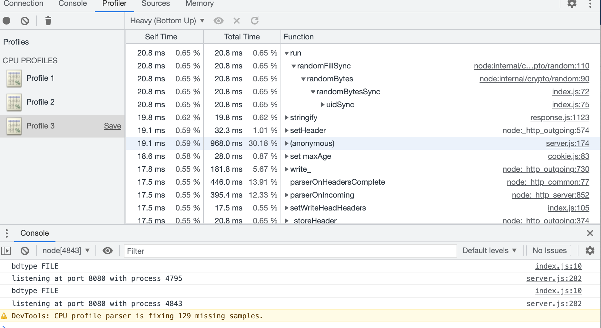
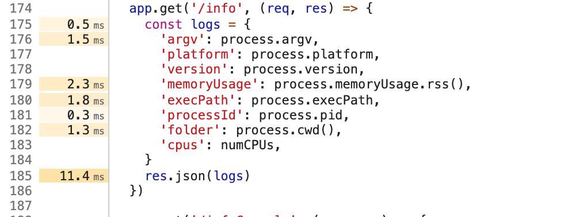
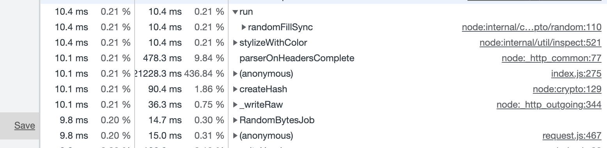
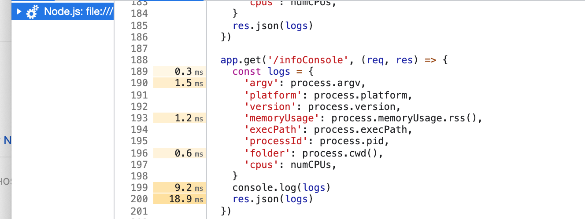
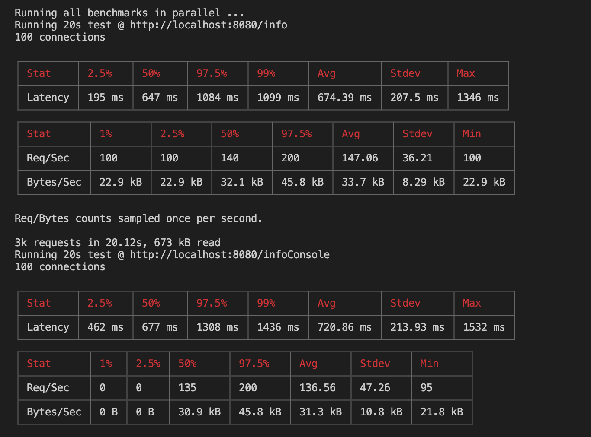

## Parte a
- Los comandos usados para la primera parte son los siguientes:
```
node --prof src/server.js
artillery quick --count 50 -n 20 "http://localhost:8080/info" > result_info.txt
node --prof-process result_info.log > conv_result_info.txt
```

```
node --prof src/server.js
artillery quick --count 10 -n 50 "http://localhost:8080/info" > result_info.txt
node --prof-process result_info.log > conv_result_info.txt
```

- Usando los comandos anteriores, se concluyo que el performance de la aplicacion es muy parecido con o sin la funcion console.log(), existe una leve mejora del endpoint que usa el console.log(); sin embargo la diferencia no es significativa.

## Parte b
- Luego de usar inspect de chrome, para el endpoint sin console.log, se obtiene que el run demora 20.8ms



- Por otro lado para el endpoint, con console.log se obtiene las siguientes imagenes, en este caso se puede ver que la funcion demora 10.4ms


- Luego de ver las imagenes, se concluye que la funcion console.log añade un tiempo de 9ms al tiempo de ejecucion del endpoint
- Por ultimo, el test realizado con autocannon muestra que la latencia de la ruta /infoConsole es mayor a la de /info

- Finalmente, el grafico de flamas se ubica en la carpeta 2998058.0x, e indica que 
